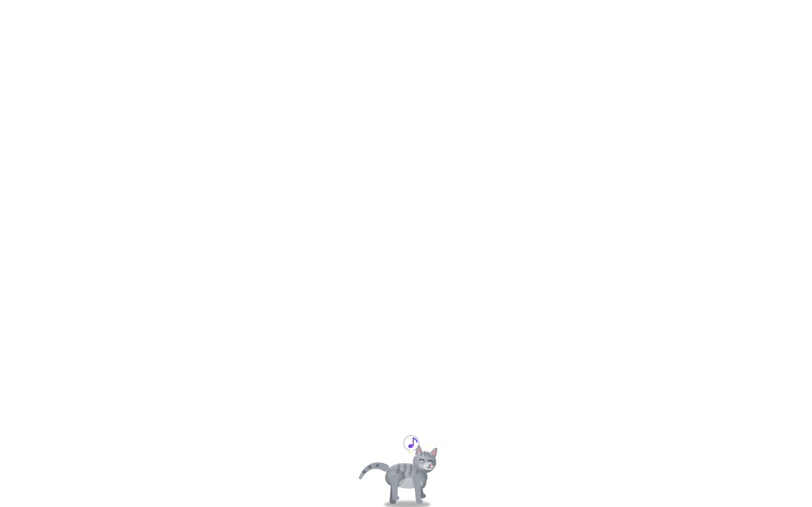
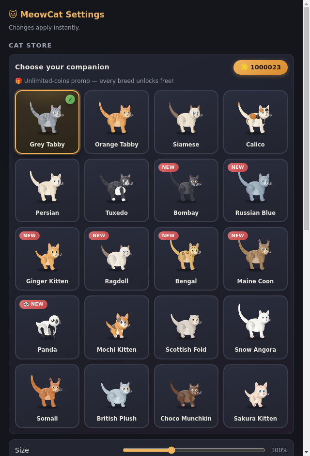
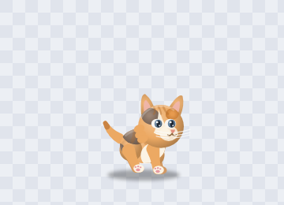
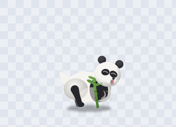

# 🐱 MeowCat

<b>A procedurally animated desktop cat for Windows 11 — every frame drawn by
code, no sprite sheets, nothing pre-rendered.</b>

MeowCat lives *on top of everything* on your screen. There is **zero image art** for the cat:
every whisker, tail wave and ear twitch is computed in real time on a canvas at 60 FPS — so it
can squash, stretch, flip, somersault and change breed with no animation frames to break.

It treats your **open windows as platforms** — walk near one and it **jumps onto the top
border, strolls along it, then hops to the nearest neighbouring window**. When a **butterfly**
flutters by, the cat hunts it like a real cat: it notices, stalks with a butt-wiggle, creeps
in, then **rears up onto its hind legs and strikes with its front paws** — the butterfly
hovers *above* paw reach and only dips down now and then, so every catch has to be *timed*;
a missed swat makes it **dodge** with a sharp climb-jink while the cat drops to all fours and
chases again. Miss three times and the butterfly escapes; connect once and you earn coins.
And it **listens**: say **“hey cat, play music <song>”** and it opens Brave on YouTube and
plays the first result — with pause, skip and volume commands to match. Pick the **Panda**
and it behaves like a real bear — it **waddles**, **sits up to hook and gnaw a bamboo
stalk**, **somersaults**, and naps sprawled flat.

| Live on the desktop | Premium Cat Store |
|---|---|
|  |  |

| Mochi Kitten | Panda & bamboo |
|---|---|
|  |  |

---

## ✨ Features

| | |
|---|---|
| 🎨 **Procedural 2D-canvas cat** | 8 body types, 24 breeds, radial-gradient shading, IK legs, chained pendulum tail — 100% code, 0 image frames |
| 🐱 **24 breeds, ginger kitten default** | the **Ginger Kitten** greets new users; Tabby, Siamese, Calico, Persian, Tuxedo, Bombay, Russian Blue, Ragdoll, Bengal, Maine Coon, **Panda**, Mochi, Scottish Fold, Snow Angora, Somali, British Plush, Choco Munchkin, Sakura and the kitten litter (Cocoa, Milky, Smokey, Midnight) |
| 🦋 **Real butterfly hunts (v3.15)** | butterflies visit every display, hovering **above paw reach** and periodically dipping into it — the cat stalks, **stands on its hind legs and swats**; a missed swat means a sharp **dodge-climb** and a fresh chase, 3 misses = the butterfly escapes, a well-timed connect earns 🪙 + a heart |
| 🎙️ **Voice commands (v3.16)** | say **“hey cat, play music <song>”** — it finds the first YouTube result and plays it in **Brave** (or your default browser); the cat **salutes** when it hears you and echoes the command it received; also: pause · resume · stop · next song · previous song · volume up/down · mute · “stop listening”; v3.16 rebuilt the listening chain: a **cloud-quality recognizer with an automatic offline fallback**, so accented English and mangled wake words (“hey kat”, “hay cat”) still work — and if the microphone is blocked, Settings **tells you exactly what to fix** |
| 💃 **Choreographed dance (v3.16)** | a six-step routine danced **on its hind legs**: step right → step left → **hands up** → **turn around** (it shows you its back!) → **shake tail** (the tail lashes overhead) → a happy squinting **finish** with a paw by the cheek and a heart |
| 🐈‍⬛ **Companion kitten** | a second small cat that follows the big cat, leaps up to join it on window tops, wakes when the pair separates, and play-fights |
| 🐼 **A panda that's not a cat** | bear barrel body, heavy waddle, sits up to eat bamboo with both paws, somersaults, naps sprawled — behavior researched from real giant pandas |
| 🚶 **Window-top hopping** | any window (any size, resizable) near the cat becomes a walkable platform: jump on, stroll, hop to the next window, drop back down |
| 🖥️ **True multi-monitor** | the cat can be **dragged onto the 2nd monitor** (main streams the real cursor across boundaries) and **walks there by itself** with a single discrete lane hop — no flicker, ever |
| 🚫 **No-walk zones, screenshot-style** | press "Select area on screen" and **drag a rectangle straight off the desktop** (Windows Snipping Tool style, crosshair overlay, Esc cancels); the cat refuses to walk into it, and window tops overlapping it are never used |
| 🔊 **All-sound controls** | a **master toggle** plus separate toggles for single-click meow, double-click meow, random meows, contextual sounds and the reminder chime; **double-click only plays the classic meow** — nothing opens |
| 🤫 **Quiet walking** | footsteps are gone; ambient meows are natural single calls (occasionally a burst) and never overlap a click meow |
| ⏰ **Reminders & Pomodoro** | one-shot / daily / weekly / every-N repeats with bubble + chime; focus/break timer with a celebration dance |
| 🏆 **Achievements & affection** | pet to build affection, unlock perks (sparkle landings, greeting bows) and achievements |
| 📸 **Photo mode** | Ctrl+Alt+P freezes the pose and saves a transparent PNG |
| 🪶 **Low memory** | no GPU process, one small overlay lane, services in-host — a lean process footprint |
| 🛡️ **Never quits on its own** | a hard quit gate blocks any non-explicit exit (window loss, crashes, signals, stray quits are reversed and journaled); a watchdog revives a hung overlay; only **you** can Quit |
| ⌨️ **Hotkeys & privacy** | Ctrl+Alt+C summon/hide, Ctrl+Alt+P photo, voice commands — all optional toggles; no telemetry ever |

## 🎮 Interactions

| you do | the cat does |
|---|---|
| **single click** | a natural single meow |
| **double-click** | the classic meow — that's it, nothing opens (while music is actually playing the meow politely holds its tongue and mouths a silent ♪ instead) |
| **drag & drop** | rides your cursor anywhere — including across monitor boundaries |
| **right-click** | menu: Settings · Store · Reminders · Dance · Feed · Sleep · Quit |
| **say “hey cat …”** | it **salutes**, echoes your command and obeys: play music · pause · next · volume · mute (even “hey kat” and friends — it forgives accents) |
| **feed it** | a fish appears — it bites, chews and swallows (the panda gets bamboo) |
| **idle cursor nearby** | it may stalk and pounce it — the butterfly hunts are never interrupted |
| **nothing** | it lives its own life: strolls, naps, grooms, hunts butterflies, makes biscuits |

## 📥 Install (Windows 11)

1. Download **`MeowCat-3.16.0-portable.exe`** from the [latest release](../../releases/latest).
2. Double-click it — no installer, no runtime, no admin rights. A tray icon appears and the
   cat starts exploring.
3. Quit anytime from the tray menu.

> Fully self-contained (Electron 33 embedded) — nothing else to install. The process is named
> **MeowCat** in Task Manager, not some framework name.

## ❓ FAQ

* **Is anything sent to the internet?** MeowCat itself has no telemetry. The features that touch
  the network are the voice music command (it looks up the first YouTube result for the song you
  asked for and opens it in your own browser) and voice recognition itself: commands are understood
  through Chromium's speech recognizer when you are online, with the Windows offline engine as an
  automatic fallback. Only recognized command phrases are processed — nothing is recorded or stored
  by the cat, and voice commands can be switched off entirely in Settings → Hotkeys & Privacy.
* **Does it slow my PC down?** It's a single small canvas being redrawn — no GPU process, one
  helper window, services in-host.
* **Why is the cat sometimes on a window?** Windows' top borders are its shelves — it's a
  feature, not a glitch. It will hop down on its own.
* **Why didn't my zone-selection show on the other monitor?** Move the mouse there — the
  crosshair overlay follows your cursor across displays.
* **The cat disappeared / my PC slept** — it revives itself. It cannot quit on its own; only
  the tray menu's Quit (or you) can close it.
* **How do I get the Panda / Mochi Kitten?** Right-click the cat → Cat Store. Everything is
  free during the unlimited-coins promo.

## 👨‍💻 Developer

Built by [**mythos0**](https://github.com/mythos0) — the private source repository, the public
issue tracker and future releases all live on GitHub.

## 📄 License

MIT © 2026 mythos0 — see [LICENSE](LICENSE).
