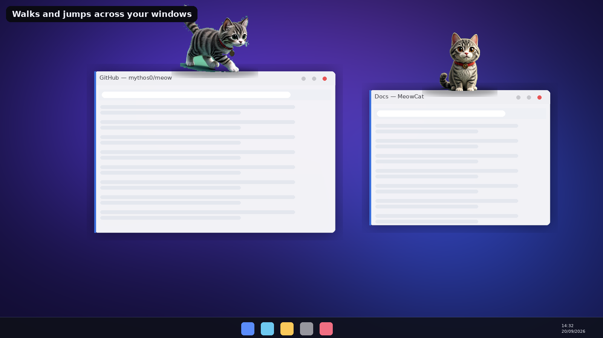
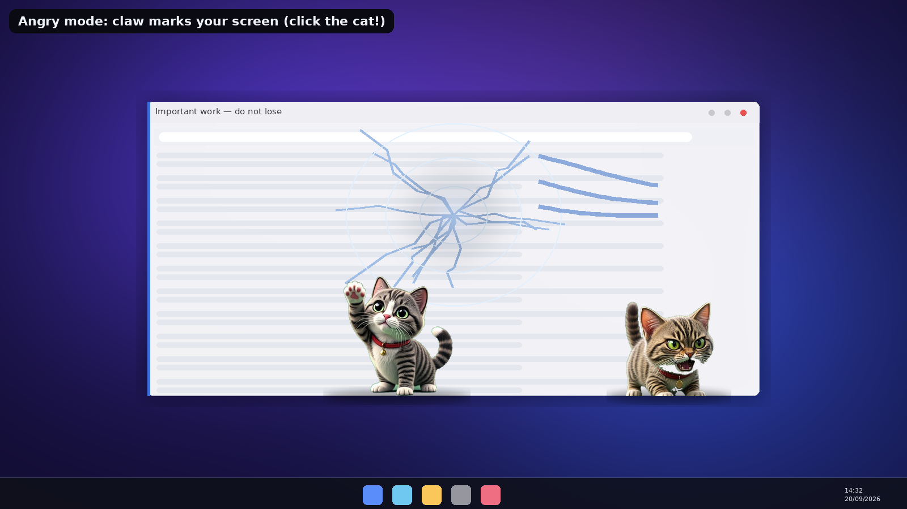
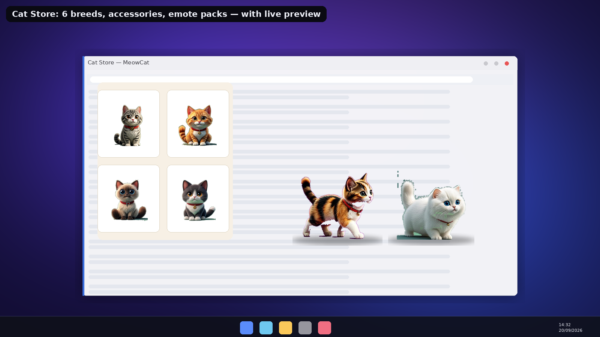

# 🐱 MeowCat

<b>A realistic, frame-animated desktop cat for Windows 11 — free, fluent, and a little bit naughty.</b>

MeowCat lives *on top of everything* on your screen. It is drawn from **AI-generated
photographic-quality frames** — every action is a hand-tuned sprite sequence (8-frame motion clips,
4-frame idle clips) blended with **real-time cross-fade interpolation at 60 FPS**, so it moves like
a living animal instead of a flipbook.

It strolls along your taskbar, **hops onto the title bars of your open windows and walks from
window to window**, dances, naps, chases your cursor, plays with yarn, and when you minimize
everything it **wanders between the folder icons on your desktop and scratches next to them**.
If you make it angry, it **claws your screen** — realistic spiderweb cracks and gouges appear
*above* all your windows until the cat calms down and every crack fades away.

---

## ✨ Features

| | |
|---|---|
| 🐈 **Realistic frame animation** | AI-generated photoreal kitten — 6 breeds, 60 FPS cross-faded playback, 0.5×–2× size |
| 🚶 **Window-top strolling** | Walks near a window → auto-jumps onto its title bar → strolls along it → hops to the *nearest* neighbouring window and continues |
| 🖥️ **Desktop explorer** | All windows minimized? The cat walks between your actual desktop folder icons (real shell positions) and scratches beside them |
| 😠 **Angry mode** | Click the grumpy cat → claw swipes stamp **broken-glass cracks** on a topmost click-through overlay. Give it a treat and every crack fades away |
| ⏰ **Reminders & timers** | Time, repeat (once / daily / weekly / every 30 min / hourly), custom message — and **the cat performs the movement you picked** when your reminder fires (speech bubble + tray toast + a real meow) |
| 🛒 **Cat Store** | Breeds, party hats, top hats, bows, glasses, scarves, 5 emote packs — every card with a **live animated preview** |
| 🪙 **Fun coins** | Your cat earns coins by living, dancing, jumping and being petted; spend them in the store |
| 🔊 **Real cat sounds** | Three recorded meows, purr, hiss, growl, glass break + subtle footsteps, whoosh and coin foley |
| ⚙️ **Settings** | Launch with Windows, sound & volume, cat size, reminder popups — persisted, corrupt-safe |
| 🚫 **Always visible** | Native topmost enforcement keeps the cat above fullscreen apps and games |

## 📸 Screenshots

| Angry mode — broken glass | Desktop stroll |
|---|---|
|  |  |

| Reminders with cat animations | Cat Store |
|---|---|
|  |  |

## 📥 Install (Windows 11)

1. Download **`MeowCat-2.0.0-x64.msi`** from the [latest release](../../releases/latest).
2. Double-click → installs to `Program Files\MeowCat`, creates a **desktop shortcut**, a
   Start-Menu entry, and an *Apps & Features* entry.
3. To remove: *Settings ▸ Apps ▸ MeowCat ▸ Uninstall* (or run the MSI again to repair/upgrade).

> Requires the **.NET 8 Desktop Runtime (x64)** —
> [download here](https://dotnet.microsoft.com/download/dotnet/8.0/runtime).

**Meet your cat:** right-click it (or the tray icon) for the full menu — Cat Store, Reminders,
Settings, *Make angry* (then click the cat!). Two quick clicks on the cat = a real meow. 🐾

## 🧩 How it works

- **WPF topmost overlay** — the cat is a transparent window spanning your screen; transparent
  pixels pass every click through to your apps.
- **AI brain** — happiness / energy / boredom drive weighted autonomous actions; the platform
  tracker knows which window top edge (or desktop icon row) the cat is standing on.
- **Frame renderer** — 512×512 keyed frames, contact shadows that shrink mid-air, emotes,
  accessories anchored per pose, speech bubbles.
- **Native interop** — `EnumWindows` for jump targets, shell `SysListView32` for real desktop icon
  positions, `SetWindowPos(HWND_TOPMOST)` re-assertion so fullscreen apps never bury the cat.

## 📄 License

MIT — see [LICENSE](LICENSE). Cat artwork and sounds are generated/downloaded assets shipped with
the app.
