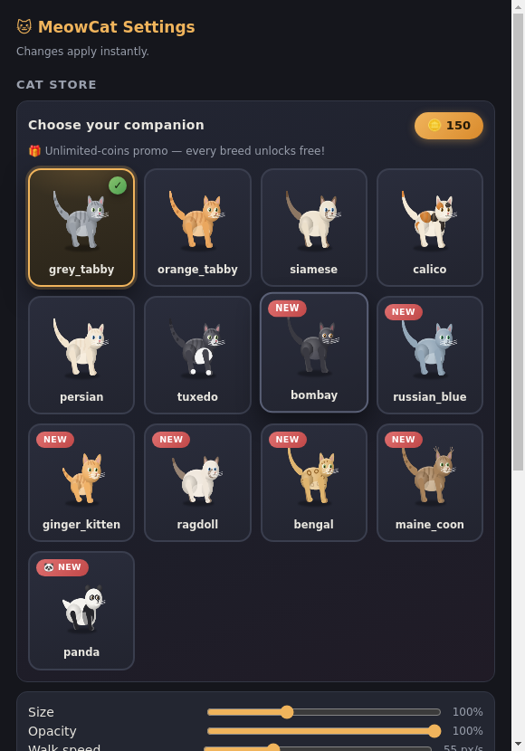
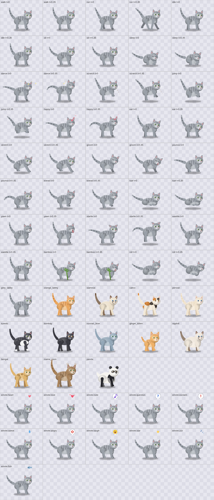

# 🐱 MeowCat

<b>A procedurally animated desktop cat for Windows 11 — every frame drawn by
code, no sprite sheets, nothing pre-rendered.</b>

MeowCat lives *on top of everything* on your screen. There is **zero image art** for the cat:
every whisker, tail wave and ear twitch is computed in real time on a canvas at 60 FPS — so it
can squash, stretch, flip, somersault and change breed with no animation frames to break.

It strolls your taskbar, treats your **open windows as platforms** — walk near one and it
**jumps onto the top border, strolls along it, then hops to the nearest neighbouring window**.
Minimize everything and it roams the **full screen like an open field, wandering from random
place to random place**. Pick the **Panda** and it waddles, somersaults, and munches a bamboo
stalk it holds in its paws.

| Live on the desktop | Premium Cat Store — 13 breeds |
|---|---|
|  |  |

| Every action × breed × emote | Panda & bamboo |
|---|---|
|  |  |

---

## ✨ Features

| | |
|---|---|
| 🎨 **Procedural 2D-canvas cat** | 6 body types, 13 breeds, radial-gradient shading, IK legs, chained pendulum tail — 100% code, 0 image frames |
| 🐼 **13 breeds** | Grey/Orange Tabby, Siamese, Calico, Persian, Tuxedo, Bombay, Russian Blue, Ginger Kitten, Ragdoll, Bengal, Maine Coon — and a **Panda** with its own actions |
| 🤸 **20 actions** | walk, run, sit, sleep, dance, scratch, jump, eat, stretch, groom, pounce, knead, loaf, yawn, startle + panda-only waddle, bamboo munch and somersault roll |
| 💗 **11 emotes** | hearts, music note, question, exclaim, sweat, anger mark, laugh, star, Zzz, fish — pop in above the cat's head, context-aware |
| 🚶 **Window-top hopping** | any window (any size) near the cat becomes a walkable platform: jump on, stroll, hop to the next window, drop back down |
| 🌾 **Open-field roaming** | with nothing to climb, the cat wanders the whole screen to random spots like an open field |
| ⏰ **Reminders & timers** | one-shot / daily / weekly / every-N repeats — the cat announces yours with a movement, a speech bubble and a chirp |
| 🛒 **Cat Store** | premium dark storefront with live previews; **unlimited-coins promo — every breed unlocks free** |
| ⚡ **Instant settings** | double-click the cat → Settings opens in milliseconds (warm window pool) |
| 🔊 **Real sounds** | three recorded meows, purr, chirp, footsteps, scratch foley — drag & drop is quiet on purpose |
| 🚫 **Always visible** | topmost enforcement keeps the cat above fullscreen apps and games |
| 🧸 **About & credits** | version info and the developer's GitHub, one click away |

## 🎮 Interactions

| you do | the cat does |
|---|---|
| **double-click** it | opens the Settings popup instantly |
| single click | purrs, shows love, earns you coins |
| drag & drop | rides your cursor; lands on the nearest window border or the ground |
| right-click | menu: Settings · Reminders · Dance · Feed · Sleep · Quit |
| nothing | it lives its own life: roams, naps, grooms, pounces, makes biscuits |

## 📥 Install (Windows 11)

1. Download **`MeowCat-3.1.0-portable.exe`** from the [latest release](../../releases/latest).
2. Double-click it — no installer, no runtime, no admin rights. A tray icon appears and the
   cat starts exploring.
3. Quit anytime from the tray menu.

> Fully self-contained (Electron 33 embedded) — nothing else to install. The process is named
> **MeowCat** in Task Manager, not some framework name.

## ❓ FAQ

* **Is anything sent to the internet?** No. MeowCat has no telemetry and no network features.
* **Does it slow my PC down?** The cat costs about as much as a browser tab — it's a single
  small canvas being redrawn.
* **Why is the cat sometimes on a window?** Windows' top borders are its shelves — it's a
  feature, not a glitch. It will hop down on its own.
* **How do I get the Panda?** Double-click the cat → Cat Store → Panda. Free during the
  unlimited-coins promo.

## 👨‍💻 Developer

Built by [**mythos0**](https://github.com/mythos0) — the private source repository, the public
issue tracker and future releases all live on GitHub.

## 📄 License

MIT © 2026 mythos0 — see [LICENSE](LICENSE).
